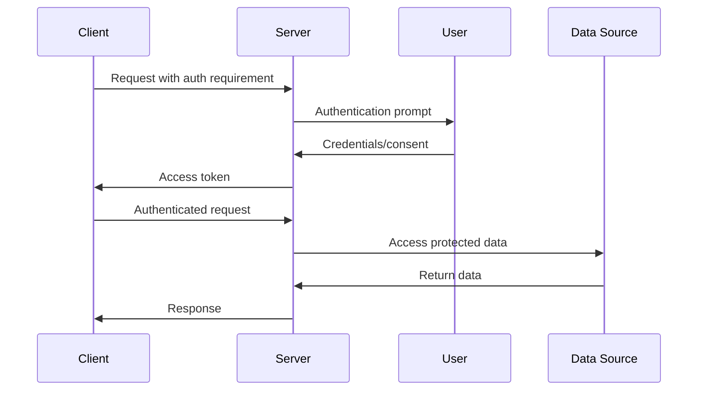
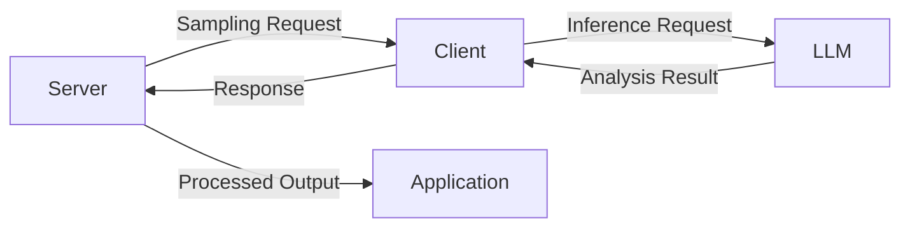
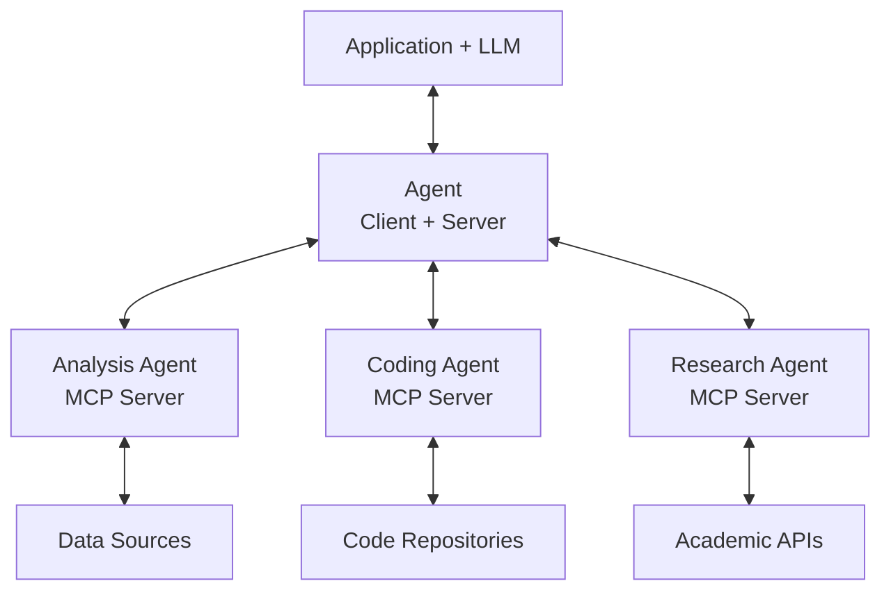
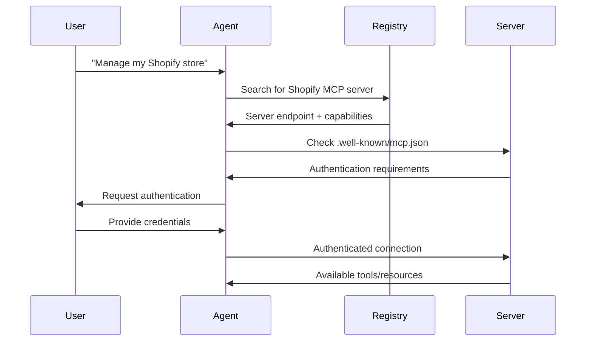

# **🎯 Conclusion**

## **📚 What You've Learned**

- **Core MCP Concepts**: Hosts, clients, servers, tools, resources, and prompts
- **Server Development**: Built servers exposing multiple primitives
- **Client Development**: Created chatbots connecting to multiple servers
- **Claude Desktop Integration**: Used professional applications with MCP
- **Remote Deployment**: Deployed servers for broader accessibility

## **🔮 Advanced Features**

### **🔐 Authentication (OAuth 2.1)**

- **Purpose**: Secure access to protected data sources
- **Implementation**: OAuth 2.1 protocol for remote servers
- **Flow**: Client → Server → User Auth → Token Exchange → Authenticated Requests
- **Scope**: Optional for Standard I/O, recommended for remote servers

### **📁 Roots**

- **Definition**: URI that clients suggest servers should operate within
- **Purpose**: Security boundaries, focused operations, path limitations
- **Types**: Filesystem paths, HTTP URLs, any valid URI
- **Benefits**: Enhanced security, improved performance, clear scope

### **🔄 Sampling**

- **Concept**: Servers request inference from LLMs
- **Direction**: Reverse communication (server → client → LLM)
- **Use Cases**: Server-side analysis, security-sensitive operations
- **Benefits**: Reduced context window usage, enhanced security

## **🚀 Future Roadmap**

### **🏪 Unified Registry**

- **Purpose**: Centralized server discovery and verification
- **Features**:
  - Server discovery and cataloging
  - Community trust verification
  - Version management and dependencies
  - Security validation

### **🤖 Multi-Agent Architecture**

### **🔍 Dynamic Discovery**

- **Well-Known Endpoints**: `.well-known/mcp.json` files
- **Auto-Discovery**: Agents find and connect to servers automatically
- **Authentication Integration**: Seamless OAuth integration
- **Example Flow**: User request → Registry search → Server discovery → Authentication → Connection

## **⚡ Ongoing Development**

### **🔧 Technical Improvements**

- **HTTP Streamable**: Smooth stateful/stateless transitions
- **Remote Server Ecosystem**: Expanded server support
- **Naming Conflicts**: Tool collision prevention
- **Sampling Enhancement**: More robust proactive context requests

### **🛡️ Security & Scale**

- **Authentication Evolution**: Beyond OAuth 2.1
- **Authorization at Scale**: Enterprise-grade permissions
- **Trust Networks**: Community-driven server validation

## **🎉 Key Takeaways**

- **MCP enables modular AI applications** through standardized protocols
- **Composable architecture** allows clients to be servers and vice versa
- **Growing ecosystem** of compatible applications and tools
- **Future-ready** with authentication, discovery, and agent capabilities
- **Active development** with community-driven improvements

## **🚀 Next Steps**

- **Explore the ecosystem**: Try different MCP-compatible applications
- **Build custom servers**: Create servers for your specific use cases
- **Join the community**: Participate in discussions and development
- **Stay updated**: Follow the specification and roadmap evolution

**The Model Context Protocol is foundational for the future of AI applications.**
